# ReviewAnalyzer

## Описание проекта

ReviewAnalyzer — это ML-сервис анализа тональности отзывов с веб-интерфейсом.
Пользователь регистрируется, входит в систему, вводит текст отзыва и получает
оценку тональности (positive / negative / neutral) с показателем уверенности
модели. Все запросы сохраняются в базе данных, и пользователь может просматривать
историю своих анализов.

Проект построен на трёхкомпонентной архитектуре и упакован в Docker-контейнеры:

- **Flask Web App** (порт 5000) — пользовательский интерфейс: регистрация,
  авторизация, формы, отображение результатов, история запросов.
- **FastAPI ML API** (порт 8000) — сервис машинного обучения, принимает текст
  отзыва и возвращает предсказание тональности.
- **PostgreSQL** (порт 5432) — хранит пользователей и историю запросов.

## Зачем нужен этот проект

Интернет-магазины, маркетплейсы и сервисы с отзывами ежедневно получают тысячи
текстовых отзывов от пользователей. Читать и классифицировать каждый вручную —
долго и дорого.

ReviewAnalyzer решает эту задачу автоматически: модель машинного обучения
определяет, является отзыв положительным, отрицательным или нейтральным.
Это позволяет:

- Быстро находить негативные отзывы и реагировать на проблемы.
- Анализировать общий «тон» обратной связи от клиентов.
- Автоматически сортировать и приоритизировать отзывы для модераторов.

## Архитектура

```
Пользователь (браузер)
        │
        ▼
   [Flask Web App]  ◄── порт 5000
        │
        │ HTTP (внутренняя сеть Docker)
        ▼
   [FastAPI ML API] ◄── порт 8000
        │
        ▼
   [PostgreSQL DB]  ◄── порт 5432
```

Flask не обращается к модели напрямую — только по HTTP к FastAPI. Это разделяет
веб-слой и слой машинного обучения: их можно разрабатывать, масштабировать
и перезапускать независимо.

### Слои кода (чистая архитектура)

Код разделён на слои, не зависящие от конкретного фреймворка. Направление
зависимостей всегда указывает внутрь — к домену.

| Слой | Папка | Назначение |
|------|-------|------------|
| Domain | `src/domain` | Бизнес-сущности (`User`, `Prediction`) и протоколы (абстракции репозиториев и классификатора). Не знает о БД и вебе. |
| Infrastructure | `src/infrastructure` | Реализации: SQLAlchemy-модели и репозитории, загрузка ML-модели. |
| Services | `src/services` | Оркестрация use-case'ов: регистрация, аутентификация, анализ тональности. |
| API / Web | `src/ml_api`, `src/web` | HTTP-обработчики: роутеры FastAPI и роуты Flask. |

Инверсия зависимостей реализована через протоколы (`src/domain/protocols.py`):
сервисы зависят от абстракций, а конкретные реализации внедряются через
конструктор.

## Стек технологий

- **Python 3.11+**, менеджер пакетов **uv** (`pyproject.toml` + `uv.lock`)
- **Flask** (шаблоны с наследованием, Flask-WTF, Bootstrap, сессии)
- **FastAPI** + Uvicorn
- **SQLAlchemy** (sync для Flask, async для FastAPI), **Alembic** для миграций
- **PostgreSQL**
- **scikit-learn** — модель `TfidfVectorizer + LogisticRegression`
- **Docker**, **docker compose**
- Инструменты: **ruff** (линтер/форматтер), **mypy** (strict), **pytest**,
  **pre-commit**, **commitizen** (Conventional Commits)

## История коммитов

### 1. `chore: заготовка проекта (uv, структура слоёв, инструменты)`

Создание скелета проекта: структура папок по слоям, `pyproject.toml` с
зависимостями, `uv.lock`, настройки ruff/mypy/pre-commit, `.env.example`.

### 2. `feat: обучение и сохранение модели анализа тональности`

Обучение модели TF-IDF + LogisticRegression на размеченном наборе отзывов
(positive / negative / neutral). Результат сохранён в `ml/model.pkl`.

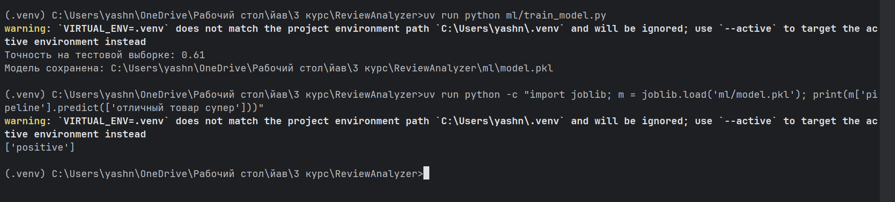

### 3. `feat: доменный слой — сущности и протоколы репозиториев`

Чистые бизнес-объекты (`User`, `Prediction`, `SentimentResult`) и протоколы
(абстракции `UserRepository`, `PredictionRepository`, `SentimentClassifier`).
Этот слой не знает о БД, HTTP и фреймворках.

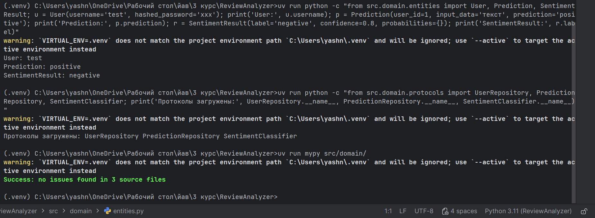

### 4. `feat: слой инфраструктуры — модели БД и миграции Alembic`

ORM-модели SQLAlchemy (таблицы `users` и `predictions`), синхронные и
асинхронные сессии, реализации репозиториев, загрузчик ML-модели.
Миграция Alembic создаёт обе таблицы с индексами и внешним ключом.

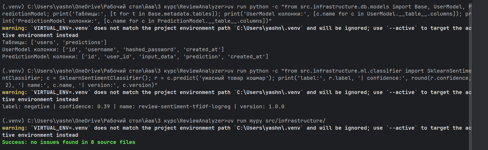

### 5. `feat: сервисный слой — аутентификация и предсказания`

`AuthService` — регистрация с хешированием пароля и аутентификация.
`PredictionService` — анализ тональности и сохранение в историю.
Оба сервиса зависят только от абстракций (протоколов), а не от конкретных
реализаций.

### 6. `feat: ML API на FastAPI (predict, health, model-info)`

Три эндпоинта: `POST /predict` (предсказание тональности), `GET /health`
(проверка работоспособности), `GET /model-info` (информация о модели).
Swagger-документация автоматически доступна на `/docs`.

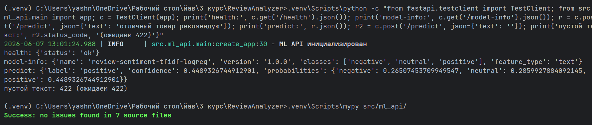

### 7. `feat: веб-приложение Flask с регистрацией и сессиями`

Блюпринт аутентификации: формы регистрации и входа с защитой от CSRF
(Flask-WTF), серверные сессии, навигация, базовый шаблон с Bootstrap.
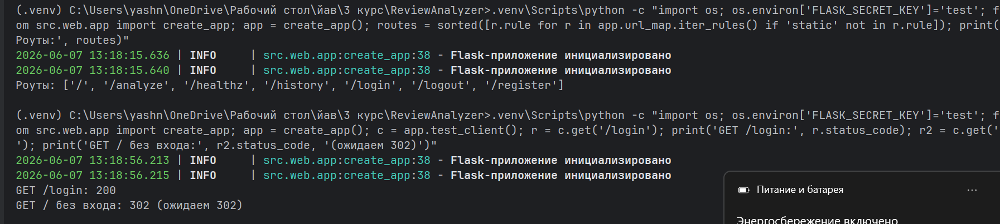
### 8. `feat: форма анализа отзыва и страница истории запросов`

Главная страница с формой ввода отзыва. После анализа — результат с
тональностью, уверенностью и прогресс-барами вероятностей по классам.
Страница истории — таблица всех запросов пользователя.

### 9. `feat: контейнеризация — Dockerfile и docker-compose`

Два Dockerfile (Flask и FastAPI) с установкой зависимостей через uv.
`docker-compose.yml` запускает три сервиса: db, fastapi, flask.
При старте Flask-контейнер автоматически применяет миграции Alembic.

### 10. `test: модульные и интеграционные тесты`

Модульные тесты сервисов (`AuthService`, `PredictionService`) с
фейковыми репозиториями (in-memory). Интеграционные тесты ML API
через `TestClient` FastAPI.

### 11. `docs: README с описанием, архитектурой и инструкцией запуска`

Финальная документация проекта.

## Как работает приложение

### Регистрация

Пользователь заходит на `/register`, вводит логин и пароль. Пароль хешируется
(werkzeug) и сохраняется в таблице `users`. После регистрации — редирект
на страницу входа.

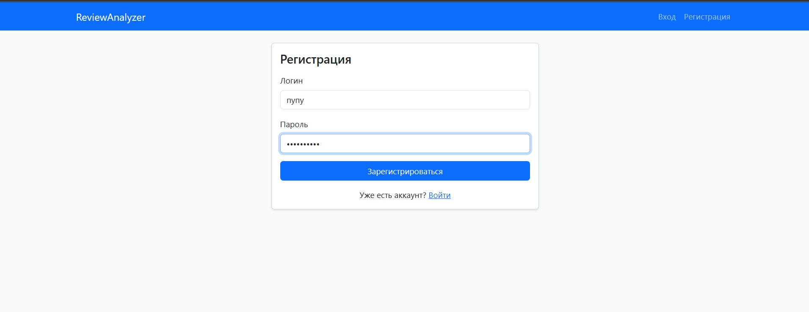
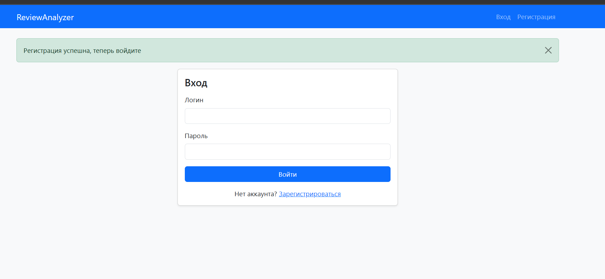

### Вход

Пользователь вводит логин и пароль на `/login`. Если данные верны — создаётся
серверная сессия, и пользователь попадает на главную страницу. Неавторизованных
пользователей перенаправляет на страницу входа.

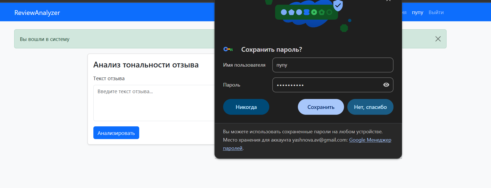
### Анализ отзыва

На главной странице (`/`) пользователь вводит текст отзыва и нажимает
«Анализировать». Flask отправляет текст в FastAPI (`POST /predict`),
получает результат и отображает:

- Тональность (positive / negative / neutral) с цветной меткой.
- Уверенность модели в процентах.
- Распределение вероятностей по всем классам (прогресс-бары).

Результат автоматически сохраняется в таблице `predictions`.
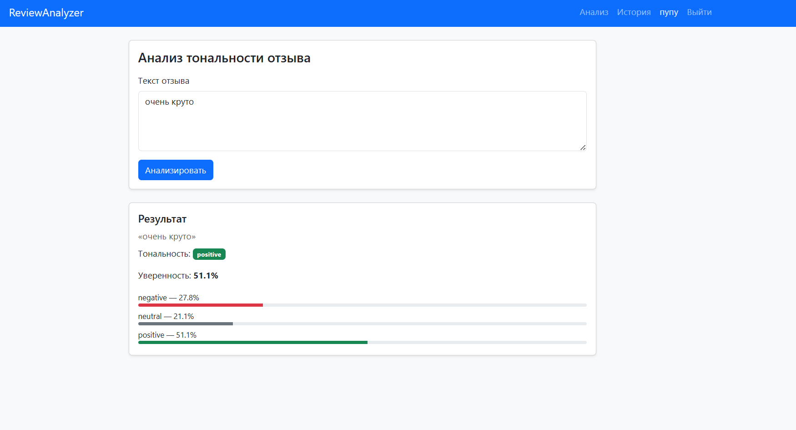
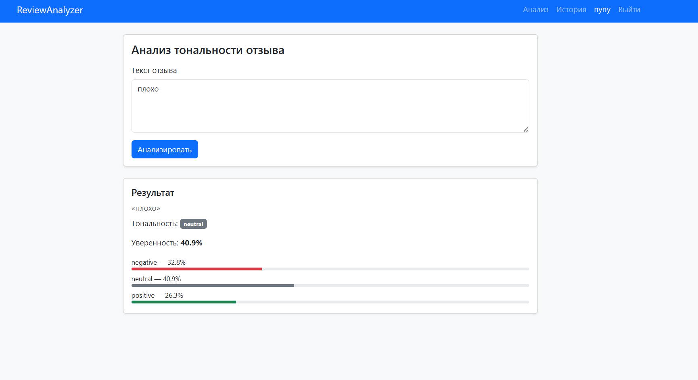

### История запросов

На странице `/history` отображается таблица всех анализов текущего
пользователя: номер, текст отзыва, тональность и дата запроса.

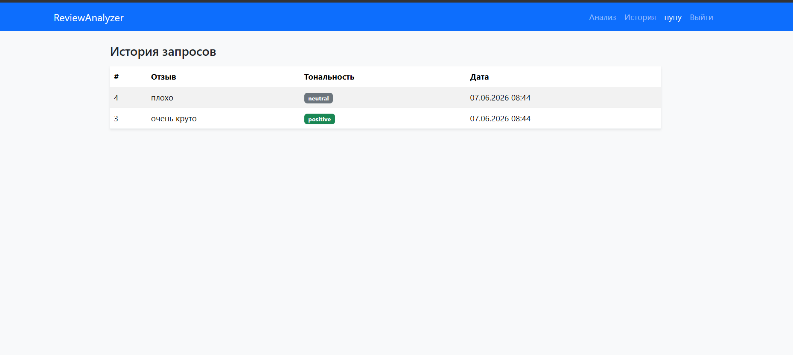

### Swagger ML API

FastAPI автоматически генерирует интерактивную документацию, доступную
по адресу `http://localhost:8000/docs`. Здесь можно протестировать
эндпоинты `/predict`, `/health` и `/model-info` вручную.

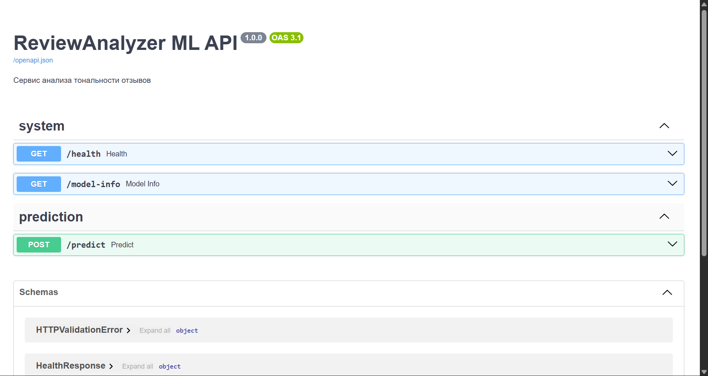

## Запуск проекта

### Через Docker (рекомендуемый способ)

1. Скопируйте файл переменных окружения:

   ```bash
   cp .env.example .env
   ```

2. Запустите все сервисы:

   ```bash
   docker compose up --build
   ```

3. Откройте в браузере: http://localhost:5000

### Остановка

```bash
docker compose down
```

## Переменные окружения

| Переменная | Назначение |
|------------|------------|
| `POSTGRES_USER` | пользователь PostgreSQL |
| `POSTGRES_PASSWORD` | пароль PostgreSQL |
| `POSTGRES_DB` | имя базы данных |
| `POSTGRES_HOST` | хост БД (`db` внутри Docker-сети) |
| `POSTGRES_PORT` | порт БД (5432) |
| `ML_API_HOST` | хост ML API (`fastapi` внутри сети) |
| `ML_API_PORT` | порт ML API (8000) |
| `FLASK_SECRET_KEY` | секретный ключ Flask (сессии, CSRF) |

Секреты не хранятся в репозитории — только в `.env` (он в `.gitignore`).

## Безопасность

- Пароли хранятся в виде хэша (`werkzeug.security`).
- Формы защищены от CSRF-атак (Flask-WTF).
- Секретные данные передаются через переменные окружения.

## Тестирование

```bash
uv run pytest -q
```

- **Модульные тесты** — `AuthService` и `PredictionService` с фейковыми
  репозиториями (без реальной БД).
- **Интеграционные тесты** — эндпоинты FastAPI через `TestClient`.

## Структура проекта

```
ReviewAnalyzer/
├── docker/
│   ├── Dockerfile.fastapi      # образ ML API
│   └── Dockerfile.flask        # образ веб-приложения
├── docs/
│   └── screenshots/            # скриншоты для README
├── migrations/                 # миграции Alembic
│   └── versions/
│       └── 0001_initial.py
├── ml/
│   ├── train_model.py          # скрипт обучения модели
│   └── model.pkl               # обученная модель
├── src/
│   ├── config.py               # настройки (переменные окружения)
│   ├── domain/                 # сущности и протоколы
│   ├── infrastructure/         # БД и ML-классификатор
│   ├── services/               # бизнес-логика (use-cases)
│   ├── ml_api/                 # FastAPI: роутеры, схемы, точка входа
│   └── web/                    # Flask: роуты, формы, шаблоны
├── tests/                      # модульные и интеграционные тесты
├── docker-compose.yml
├── pyproject.toml
├── uv.lock
├── alembic.ini
├── .pre-commit-config.yaml
├── .env.example
└── .gitignore
```